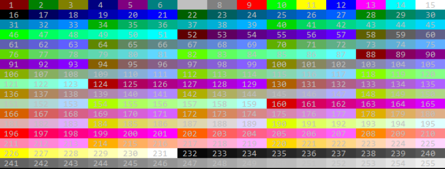

# Prompt for Bash

lightweight script that prints useful prompt command for developers

## Intro

'Prompt for bash' is a lightweight configurable script that prints a useful and configurable prompt command for
developers.

The developer can configure the prompt with colors and sets of useful information such as:

* user and host name
* current time
* last exit code
* working directory
* current git project information
* elapsed time of the previous command

## Installation

'Prompt for bash' is installed by running one of the following commands in your terminal.

```bash
curl https://raw.githubusercontent.com/rozidan/prompt-for-bash/main/install.sh | bash
```

This downloads the 'prompt_for_bash' to the user home folder,
places the 'source .prompt_for_bash' in '.bashrc' file, and
apply it to the current session.

## Configuration

'Prompt for bash' is configured with env's.
Any change to an env configuration is applied automatically.
You can use the '~/.bashrc' file in order to set them presently.

### Order of the info blocks

| env name          | Description | default                                              |
|-------------------|-------------|------------------------------------------------------|
| __PS1_PROMPT_LIST | description | ('TIMER' 'EXIT_CODE' 'CLOCK' 'USER_HOST' 'GIT' 'WD') |

### Can be configured as a multiline prompt

| env name               | Description | default |
|------------------------|-------------|---------|
| __PS1_ENABLE_MULTILINE | description | true    |
| __PS1_MULTILINE_CHAR1  | description | '┌─'    |
| __PS1_MULTILINE_CHAR2  | description | '└►'    |

### Enable separators between blocks

| env name                | Description | default |
|-------------------------|-------------|---------|
| __PS1_ENABLE_SEPARATORS | description | true    |
| __PS1_RIGHT_SEPARATOR   | description | ''     |

### Elapsed time of the previous command

| env name                  | Description | default |
|---------------------------|-------------|---------|
| __PS1_TIMER_PROMPT_PREFIX | description |         |
| __PS1_TIMER_PROMPT_SUFFIX | description |         |
| __PS1_TIMER_FG_COLOR      | description | 178     |
| __PS1_TIMER_BG_COLOR      | description | 0       |

### Last exit code

| env name                         | Description | default |
|----------------------------------|-------------|---------|
| __PS1_EXIT_CODE_MODE             | description | full    |
| __PS1_EXIT_CODE_SHOW_SIGNAL_DESC | description | true    |
| __PS1_EXIT_CODE_PROMPT_PREFIX    | description |         |
| __PS1_EXIT_CODE_PROMPT_SUFFIX    | description |         |
| __PS1_EXIT_CODE_OK_CHAR          | description | '✔'     |
| __PS1_EXIT_CODE_ERROR_CHAR       | description | '✘'     |
| __PS1_EXIT_CODE_SIGNAL_CHAR      | description | '»'     |
| __PS1_EXIT_CODE_FG_COLOR_SIGNAL  | description | 0       |
| __PS1_EXIT_CODE_BG_COLOR_SIGNAL  | description | 11      |
| __PS1_EXIT_CODE_FG_COLOR_ERROR   | description | 0       |
| __PS1_EXIT_CODE_BG_COLOR_ERROR   | description | 9       |
| __PS1_EXIT_CODE_FG_COLOR_OK      | description | 0       |
| __PS1_EXIT_CODE_BG_COLOR_OK      | description | 71      |
| __PS1_EXIT_CODE_FG_COLOR         | description | 15      |
| __PS1_EXIT_CODE_BG_COLOR         | description | 235     |

### Working directory

| env name               | Description | default |
|------------------------|-------------|---------|
| __PS1_WD_MODE          | description | full    |
| __PS1_WD_PROMPT_PREFIX | description |         |
| __PS1_WD_PROMPT_SUFFIX | description |         |
| __PS1_WD_FG_COLOR      | description | 255     |
| __PS1_WD_BG_COLOR      | description | 237     |

### User and host name

| env name                      | Description | default |
|-------------------------------|-------------|---------|
| __PS1_SHOW_HOST               | description | false   |
| __PS1_USER_HOST_PROMPT_PREFIX | description |         |
| __PS1_USER_HOST_PROMPT_SUFFIX | description |         |
| __PS1_USER_HOST_FG_COLOR      | description | 0       |
| __PS1_USER_HOST_BG_COLOR      | description | 250     |

### Current time

| env name                  | Description | default    |
|---------------------------|-------------|------------|
| __PS1_CLOCK_FORMAT        | description | "%H:%M:%S" |
| __PS1_CLOCK_PROMPT_PREFIX | description |            |
| __PS1_CLOCK_PROMPT_SUFFIX | description |            |
| __PS1_CLOCK_FG_COLOR      | description | 255        |
| __PS1_CLOCK_BG_COLOR      | description | 237        |

### Git info

| env name                      | Description | default          |
|-------------------------------|-------------|------------------|
| __PS1_GIT_SHOW_DETAILS        | description | true             |
| __PS1_GIT_IGNORE_UNTRACKED    | description | false            |
| __PS1_GIT_SHOW_CURRENT_USER   | description | true             |
| __PS1_GIT_SHOW_REMOTE_INFO    | description | auto             |
| __PS1_GIT_SIGN                | description | ''              |
| __PS1_GIT_CURRENT_USER_PREFIX | description | ' ('             |
| __PS1_GIT_CURRENT_USER_SUFFIX | description | ')'              |
| __PS1_GIT_PROMPT_DIRTY        | description | ' ✗'             |
| __PS1_GIT_PROMPT_CLEAN        | description | ' ✓'             |
| __PS1_GIT_AHEAD_CHAR          | description | '↑'              |
| __PS1_GIT_BEHIND_CHAR         | description | '↓'              |
| __PS1_GIT_UNTRACKED_CHAR      | description | '?:'             |
| __PS1_GIT_UNSTAGED_CHAR       | description | 'U:'             |
| __PS1_GIT_STAGED_CHAR         | description | 'S:'             |
| __PS1_GIT_BRANCH_TRACK_PREFIX | description | ' → '            |
| __PS1_GIT_BRANCH_GONE_PREFIX  | description | ' ⇢ '            |
| __PS1_GIT_TAG_PREFIX          | description | 'tag:'           |
| __PS1_GIT_DETACHED_PREFIX     | description | 'detached:'      |
| __PS1_GIT_AHEAD_CHAR          | description | '↑'              |
| __PS1_GIT_BEHIND_CHAR         | description | '↓'              |
| __PS1_GIT_NONE                | description | '○'              |
| __PS1_GIT_DIRTY_SIGNS         | description | (   '¹' '²' '³') |
| __PS1_GIT_PROMPT_PREFIX       | description |                  |
| __PS1_GIT_PROMPT_SUFFIX       | description |                  |
| __PS1_GIT_FG_COLOR            | description | 0                |
| __PS1_GIT_BG_COLOR            | description | 30               |

### Available colors



## Uninstalling

Remove the 'source ~/.prompt-for-bash' line from the '~/.bashrc' file.
Remove the '~/.prompt-for-bash' file.
